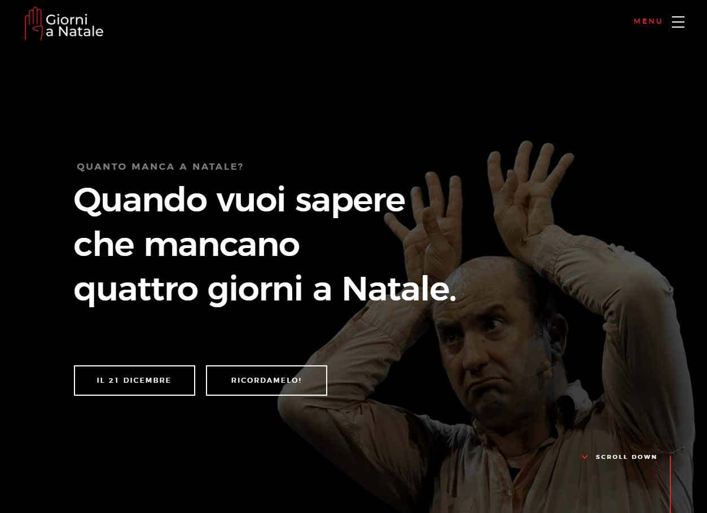
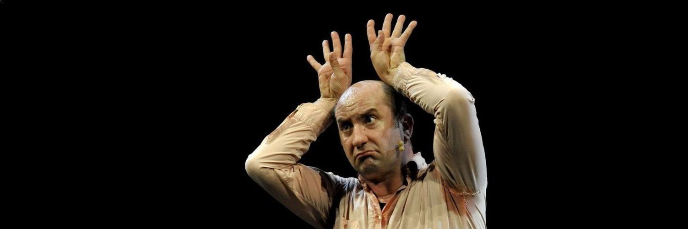
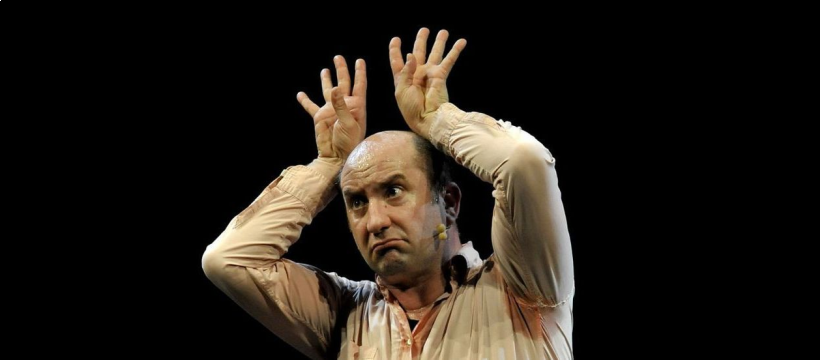

# 4 giorni a Natale - risorse per i "devoti"

[**Antonio Albanese**](https://www.wikiwand.com/it/Antonio_Albanese) ha creato circa 20 anni fa uno **sketch indimenticabile**. In "Giù al Nord" il suo "Alex Drastico", ricorda i propri momenti difficili dei primi anni da migrante al "nord". 
Il tutto avviene a fine dicembre - un momento in cui spesso si fa il "tagliando" del vissuto, con pensieri e ricordi - quando mancano "**4 giorni a Natale**".

La gran parte delle persone che guarda [questa esibizione](https://www.youtube.com/watch?v=l1qv_nCRd8U) rimane indelebilmente segnata e festeggia conseguentemente la "**vigilia**" il **20 dicembre** e fa **gli auguri** alle persone che ama il **21**: è diventata a tutti gli effetti una **DEVOZIONE**!

[Dontyna](https://twitter.com/dontyna) e [io](https://twitter.com/aborruso) siamo amici e abbiamo scoperto qualche anno fa la "passione" (mania? ossessione? o appunto devozione) comune per il 21 dicembre.
Per me è pari a una festa nazionale, ho persino modificato [il calendario](https://twitter.com/aborruso/status/1075009144837558272), e tre anni fa ho creato [una ricetta IFTTT](https://medium.com/@aborruso/la-ricetta-ifttt-migliore-che-abbia-mai-creato-b047e49ea978) molto speciale. Per Donata è una vera tradizione: svegliarsi il 21 dicembre, ancora a letto, e cercare su YouTube **il video** di Antonio Albanese. 
Sappiamo di non essere gli unici matti in circolazione e vogliamo aiutarvi a non dimenticare questa giornata COSÌ IMPORTANTE e per questa ragione abbiamo raccolto qui delle risorse.

Se sei arrivato sino a qui e NON HAI MAI VISTO **4 giorni a Natale** FALLO ORA (<https://www.youtube.com/watch?v=l1qv_nCRd8U>)!

## Il sito ufficiale

Ebbene sì, **dontyna** l'anno scorso ha avuto l'idea di creare un **sito dedicato**: <https://www.quattrogiornianatale.it/>.

Se vuoi, ti registri e ogni hanno riceverai un'email quando mancheranno **4 giorni a Natale**.

## I "santini"

Sono stati creati dei "santini" da usare nei *social*. Se li usi e ti fa piacere cita 🙏🙏 per favore il [sito ufficiale](https://www.quattrogiornianatale.it/>).

### Cover account twitter

Dimensioni: `1500 x 500` pixel. 
Download: [`png`](https://github.com/aborruso/4giornialnatale/raw/master/risorse/twitter-cover_4giorniANatale.png), [`pdf`](https://github.com/aborruso/4giornialnatale/raw/master/risorse/twitter-cover_4giorniANatale.pdf), [`svg`](https://github.com/aborruso/4giornialnatale/raw/master/risorse/twitter-cover_4giorniANatale.svg).

### Cover account facebook

Dimensioni: `820 x 360` pixel 
Download: [`png`](https://github.com/aborruso/4giornialnatale/raw/master/risorse/facebook-cover_4giorniANatale.png), [`pdf`](https://github.com/aborruso/4giornialnatale/raw/master/risorse/facebook-cover_4giorniANatale.pdf), [`svg`](https://github.com/aborruso/4giornialnatale/raw/master/risorse/facebook-cover_4giorniANatale.svg).

## Per ricevere ogni anno un avviso via IFTTT

Una "ricetta" IFTTT che - una volta attivata - ti ricorderà ogni anno che è il **21 dicembre** e potrai fare gli auguri a tutte le persone a te care: https://ifttt.com/applets/231523p-mancano-4-giorni-al-natale-per-non-dimenticare-ogni-anno-di-inviare-questo-augurio-ai-propri-cari

# Dedica

Dedichiamo questo spazio alle persone con cui nella vita abbiamo avuto e abbiamo il piacere di condividere questa devozione.

**Grazie mille Antonio Albanese**!!!
